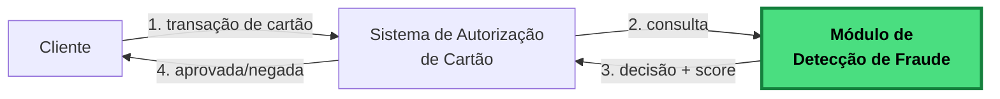

# Rinha de Backend 2026 – Detecção de Fraude por Busca Vetorial!

## Sobre esta edição

O desafio é construir uma **API de detecção de fraude em autorizações de cartão**. Sua API recebe uma transação, transforma-a em um vetor e usa **busca vetorial** contra um dataset de referência com transações já classificadas como fraudulentas ou legítimas para decidir se a transação deve ser aprovada ou negada junto com um score de fraude.



O módulo destacado em verde é **o que você vai construir**.


## O básico do desafio

1. A API recebe um `POST /fraud-score` com os dados da transação.
1. Normaliza os campos em um vetor de 14 dimensões (valores entre `0.0` e `1.0`).
1. Faz uma **busca vetorial** no dataset de referência.
1. Pega os `K=5` vizinhos mais próximos e faz votação por maioria.
1. Retorna `{ approved, fraud_score }`, por exemplo:
   ```json
   { "approved": false, "fraud_score": 0.8 }
   ```

E o clássico da Rinha: um load balancer com duas ou mais APIs e o perrengue de sempre com quase nada de CPU e memória.

---

## Roteiro de leitura

A documentação está organizada em quatro grandes blocos. Siga na ordem se for sua primeira leitura.

### 1. O que você precisa construir

- **[API.md](./API.md)** — Contrato dos endpoints (`POST /fraud-score`, `GET /ready`), formato do payload e da resposta.
- **[ARQUITETURA.md](./ARQUITETURA.md)** — Limites de CPU/memória, docker-compose, nginx, porta 9999, stateless.

### 2. Como funciona a detecção

- **[BUSCA_VETORIAL.md](./BUSCA_VETORIAL.md)** — O que é busca vetorial e KNN, com exemplo passo-a-passo. *Essencial se você nunca trabalhou com vetores.*
- **[VETORIZACAO.md](./VETORIZACAO.md)** — As 14 dimensões do vetor, fórmulas e constantes de normalização. *A especificação exata que você precisa implementar.*
- **[EXEMPLOS.md](./EXEMPLOS.md)** — Quatro fluxos completos do payload bruto até a resposta.

### 3. Os dados

- **[DATASET.md](./DATASET.md)** — Formato dos arquivos de referência (`references.json.gz`, `mcc_risk.json`, `normalization.json`).

### 4. Participação e avaliação

- **[SUBMISSAO.md](./SUBMISSAO.md)** — Passo-a-passo do PR, branches (`main` e `submission`), como abrir a issue `rinha/test`.
- **[AVALIACAO.md](./AVALIACAO.md)** — Fórmula de pontuação, peso de FP/FN, multiplicador de latência, como rodar o teste local.
- **[FAQ.md](./FAQ.md)** — Dúvidas recorrentes, armadilhas comuns, o que pode e não pode.

---

Para o sumário geral, volte ao [README principal](../../README.md).
